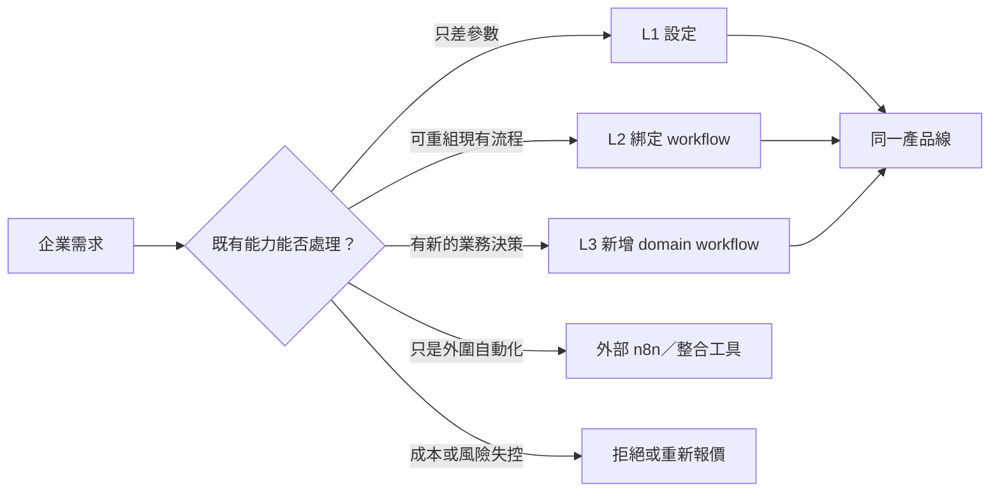
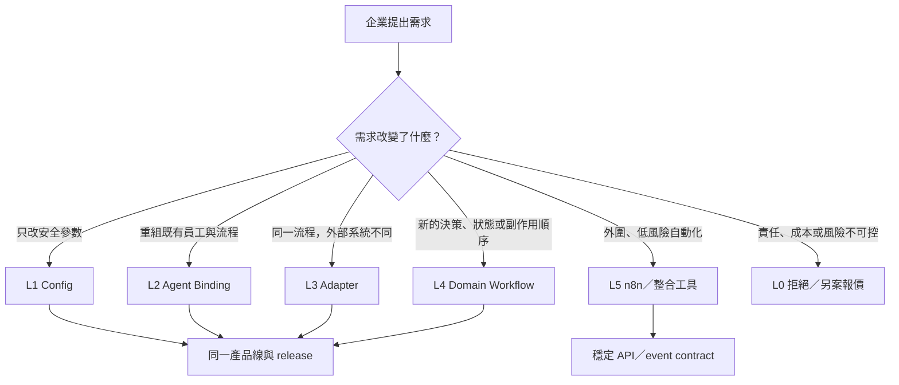
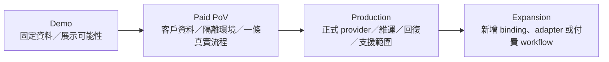

# KV 企業產品化策略實驗室

> 狀態：Working draft。這份文件用來腦力激盪、比較方案與記錄尚待驗證的商業假設；`PRODUCTIZATION_PLAN.md` 仍是唯一執行計畫與 readiness 記錄。策略一旦確定，才把可執行項目收斂回主計畫。

## 1. 我們現在要解決的問題

KV 不能只是一套替 Dennis 客製完成、日後每加一名 AI 員工就複製更多程式碼的專案。它也不應直接膨脹成另一套 n8n。

我們要把它做成一項可重複販售的企業服務：

- 能用現有能力快速組成符合企業需求的 AI 員工與流程。
- 真正不同的產業邏輯，能沿同一套擴充規格開發，不產生客戶專屬 fork。
- 每家企業可獨立部署、設定、驗收、升級與除錯。
- 銷售展示的承諾、實際可用功能與收費範圍一致。
- 客製收入不被長期維護、外部服務與人工支援成本吃掉。

主要讀者是 CabLate 的產品決策者、工程團隊與未來的導入人員。這份文件要幫大家回答四個問題：賣什麼、哪些可以配置、哪些需要開發、哪些需求不該接。

## 2. 目前版本：受控客製，不自建 n8n

### 已決定的方向

1. 第一階段採「每家企業一套 app、Supabase 與 provider keys」的隔離部署。
2. 產品提供固定、可組合的能力與 workflow，不承諾任意拖拉式流程編排。
3. 業務規則留在各 domain module；共用層只提供註冊、版本、設定驗證、執行紀錄與測試契約。
4. 新客戶差異優先透過設定與既有 workflow binding 解決。只有真正新的業務決策才新增 domain workflow。
5. 外圍、通用、低風險的自動化，日後可透過穩定 API／event 交給 n8n；Visit、Orders、Support、人工核准等核心狀態流程仍由 KV 持有。

### 版本 0 快照：客製需求的三個層級

這是本輪開始時的模型，保留用來記錄思路演進。壓力測試發現它把 provider 差異、外圍自動化與拒絕條件都擠進「擴充」，因此已由第 7 節的六出口模型取代，不作為執行分類。

| 層級 | 客戶需求 | 我們怎麼做 | 交付成本 |
|---|---|---|---|
| L1 設定 | 收件人、排程、語氣、開關、允許的操作 | 修改有 schema 的 deployment／workflow settings | 低；不改程式 |
| L2 組合 | 新員工沿用既有能力與流程 | 建立 Agent instance，綁定已支援的 workflow 與 provider connection | 中低；不複製 route／module |
| L3 擴充 | 新的產業決策、狀態或副作用順序 | 用標準 Workflow SDK 新增 domain workflow、adapter、測試與驗收 | 中高；納入共用產品線 |

如果需求只是一次性資料搬運、通知轉接或 SaaS 串接，可評估放在外部自動化工具，不把所有東西塞進 KV。

三個核心概念仍保留，但編號與邊界以第 7 節為準。

### 預計建立的窄版 Workflow SDK

```ts
defineWorkflow({
  id,
  version,
  trigger,
  configSchema,
  capabilities,
  handler,
})
```

SDK 只解決重複交付真正需要的共通問題：

- workflow 註冊、版本與相容策略；
- 設定 schema、預設值與啟用條件；
- Agent 與 workflow binding；
- run／receipt／錯誤與追蹤資料；
- 測試範本與 deployment profile 驗證。

SDK 不包含視覺編輯器、任意 JSON step graph、通用 retry engine、plugin marketplace 或自建 queue 平台。



## 3. 這份方案仍要回答的問題

以下不是已決定事項，而是本輪腦力激盪要補齊的假設：

- 第一批最適合購買的企業、決策者與高價值情境是誰？
- 應該賣「AI 員工數量」、能力組合、導入專案，還是持續營運成果？
- 如何把 demo 轉成可量化的 proof of value，再轉成正式合約？
- 初始導入費、月費、外部用量、客製開發與維運支援應如何拆分，才不會越賣越虧？
- 哪些能力要成為固定產品包，哪些只做加購，哪些不承諾？
- 客製需求如何分流到設定、binding、adapter、domain workflow、外部 n8n 或拒絕？
- 多個客戶部署後，如何統一升級、觀察版本漂移、處理 migration 與回復？
- 何時才值得做 multi-tenant、管理 UI、workflow builder 或更完整的平台？
- 9 月要展示與販售的是哪個最小完整商品，而不是一張功能清單？

## 4. 工作假設標記

後續內容使用四種標記，避免把想法寫成事實：

- **決定**：目前團隊採用，除非新證據推翻。
- **假設**：合理但尚未用客戶、成本或使用數據驗證。
- **未知**：缺少答案，會影響產品或工程選擇。
- **觸發條件**：只有條件出現才投入，避免提前造平台。

## 5. 本輪結論：我們賣流程成果，不賣 Agent 數量

### 決定

KV 的定位是：

> 一套由工程團隊維護的企業 AI workflow product line。企業可以快速選擇與配置既有流程；新的產業流程用標準化、code-owned 的方式擴充；外圍自動化可以交給 n8n，核心狀態與副作用仍由 KV 負責。

銷售單位是「可驗收的業務結果」，不是畫面上的 Agent 數量。目前只有 Visit、Orders、Support、Team Lead 等流程有較完整的 runtime 行為；其他頁面仍混有 read-only、UI-only 或 demo projection。銷售資料必須標明成熟度，不能把所有 Agent 說成同樣完整。

```diff
- 你可以購買 12 個 AI 員工，並自由建立任何流程
+ 我們先交付一條能驗收的企業流程，再用受控方式配置、組合與擴充
```

這個定位刻意避開兩個陷阱：

- 不和 n8n、Zapier 或低程式碼平台比「什麼都能拉」。
- 不讓每個客戶各自長出一份無法升級的程式碼。

## 6. 誰最可能先買

### 假設

目前還沒有足夠證據鎖定製造、半導體、內訓或特定產業。第一批客戶應先用流程條件篩選：

- 有重複且規則相對清楚的人工流程。
- 有一名能決定規則與驗收結果的流程負責人。
- 願意提供測試資料、必要帳號與實際使用者。
- 願意先用一條流程做付費價值驗證（Paid PoV）。
- 能量測回覆時間、人工處理量、錯漏率、成交率或其他成果。

每個企業案至少要辨識四個角色：

| 角色 | 他真正關心的事 | 我們必須給的證據 |
|---|---|---|
| 業務贊助者 | 是否省人、提高轉換或改善管理 | 前後指標、成本、導入時程 |
| 流程負責人 | 現場規則、核准與接手方式是否正確 | workflow 驗收案例與例外處理 |
| IT／資安／採購 | 資料、權限、部署、外部服務與責任 | 隔離部署、連線清單、runbook、責任邊界 |
| 實際使用者 | 是否真的比原本省事 | 真實 journey、操作回饋、人工步驟變化 |

產業只決定話術與特殊規則；真正的產品楔子是「高頻、可驗收、有 owner 的流程」。

## 7. 所有客製需求只能走六個出口

這是防止 codebase 與交付成本爆炸的核心規則。



| 出口 | 何時使用 | 交付內容 | 不能偷做的事 |
|---|---|---|---|
| L1 Config | 收件人、時段、語氣、開關、核准規則 | schema、預設值、驗證、後台設定 | 不新增狀態、route 或副作用 |
| L2 Agent Binding | 新員工只是使用既有流程組合 | role、instance、workflow binding、safe config | 不複製整套 Agent 程式 |
| L3 Adapter | 業務規則相同，只換 Calendar、訂單來源或訊息服務 | provider contract 翻譯、錯誤、timeout、receipt | 不把業務判斷搬進 adapter |
| L4 Domain Workflow | 新的決策、狀態機、核准分支、資料生命週期或副作用順序 | versioned workflow、typed config、ports、測試、recovery、驗收 | 不把流程硬翻成通用 JSON steps |
| L5 外部自動化 | 非核心通知、CRM 同步、資料搬運、下游 fan-out | 穩定 API／event、acknowledgement、必要的去重 | 不交出 KV 必須保證的核心狀態 |
| L0 拒絕／另案 | 永久 fork、無限客製、高風險不可回復寫入、責任不明 | 重新界定、提高報價、限定維護或不接 | 不默默塞進基本月費 |

### 一名新員工實際上怎麼產生

```text
Agent instance（某企業中的員工）
  ├─ Role template：他是誰、負責什麼
  ├─ Workflow bindings：他能執行哪些既有流程
  ├─ Deployment-safe config：收件人、排程、語氣與核准規則
  └─ Provider connections：這家企業允許使用哪些外部服務
```

例如「半導體業務助理」不代表新增一套半導體程式。它可以先綁定 Visit、Knowledge Search 與 Team Lead Report。只有半導體業真的出現新決策或狀態，才新增 L4 workflow。

### 重複需求如何升格成產品

- 第一次：視為付費客製，先由正確 domain owner 持有。
- 第二次：比較差異，抽出已證明共用的 config、adapter 或 contract。
- 第三次以上：若仍重複且能帶來收入，才升格為正式能力包與長期相容契約。

次數只是警戒線，不是機械規則。是否升格仍要看可重用價值、維護成本與銷售需求。

## 8. 窄版 Workflow SDK 的邊界

### 決定

```ts
defineWorkflow({
  id,
  version,
  triggers,
  configSchema,
  requiredCapabilities,
  executionProfile,
  entrypoint,
})
```

它只負責「定位與治理」：

- 註冊 workflow id、版本、trigger 與 domain entrypoint。
- 找到設定 schema、需要的 capability 與執行 profile。
- 驗證 Agent binding 與 deployment profile。
- 把 workflow／binding／config version 寫入 run trace 與 receipt。
- 提供相容政策與測試 contract helper。

它不負責「通用執行」：

- 不建立視覺流程編輯器或任意 JSON step graph。
- 不動態執行任意程式。
- 不取代 domain module、現有 route 或 provider adapter。
- 不管理 credentials。
- 不建立 universal retry、queue 或 plugin marketplace。

```text
Route / Event
  → Binding resolver（找到應跑的 workflow 版本）
  → Existing domain entrypoint（執行真正業務規則）
  → Domain state / policy
  → Provider adapter
  → Receipt / activity / run trace
```

Capability 也不能只是好看的字串。它要代表可驗證的操作契約，例如 `read.calendar`、`write.calendar`、`send.line`、`receive.order.webhook`。每個 capability 必須連到 workflow requirement、provider readiness、execution trace 與 acceptance evidence。

## 9. KV 與 n8n 的分界

| 留在 KV | 可以交給 n8n／外部工具 |
|---|---|
| Visit 狀態機與人工核准 | Slack／Teams／Email 的外圍通知 |
| Orders 真實狀態、去重與 delivery receipt | CRM 欄位同步 |
| Support relay 的責任與結果 | 一次性資料搬運 |
| 金流／訂單等不可亂重送的狀態 | KV 完成決策後的 downstream fan-out |
| 需要審計、回復、idempotency 的核心流程 | 低風險、可重跑的 SaaS glue |

判斷問題很簡單：如果外部流程壞掉會讓 KV 的業務 truth 不正確，就不能把責任丟給 n8n。

## 10. 商品不要包成 12 個 Agent

### 假設中的能力包

#### A. 互動與到訪包

以 Visit 為核心：聯絡人／名片進件、可約時段、Email／Calendar、LINE 互動、人工核准與狀態紀錄。

#### B. 營運通知包

以 Orders、Support、Team Lead 為核心：事件進件、客服彙整、主管通知、團隊摘要與處理紀錄。

#### C. 企業客製流程包

先組合 A／B 的既有能力。真正新的產業規則才用付費 L4 workflow 擴充，而且必須回到共同產品線，不建立客戶 fork。

GA4、GSC、Calendar read 與其他 Agent 頁面要依實際成熟度標成 live、read-only、UI-only 或 demo；成熟前只能作為加購假設或展示，不列入正式 SLA。

## 11. 從展示走到正式合約



每個階段都要明示：

- 哪些資料與 provider 是真的。
- 哪些畫面仍是 demo、fixture 或 UI-only。
- 是否會寄信、寫 Calendar、推 LINE 或產生其他真實副作用。
- 成功、失敗、人工核准與回復由誰負責。

Paid PoV 不是「Agent 有回答」就算完成。每案應選一至三個可量測成果，例如首次完成時間、人工步驟、平均回覆時間、錯漏率、人工介入率或業務轉換。

## 12. 收費模型與毛利護欄

### 假設中的收入結構

1. Discovery／流程盤點費。
2. 初次導入、設定與驗收費。
3. 每月 deployment／managed operation 費。
4. OpenAI、Firecrawl、LINE、Google 等 provider 用量轉嫁或設上限。
5. 新 adapter 或 domain workflow 的開發費。
6. SLA、支援等級、教育訓練與持續優化費。

不先填精確價格。價格要等我們量到導入、用量、支援、升級與合作分潤成本後再定。

```text
真實毛利
  = 合約收入
  - provider 用量
  - hosting / DB
  - 導入與資料整理工時
  - 預期支援工時
  - release / migration / 維護工時
  - 通路或合作夥伴分潤
```

基本方案不默認包含：無限 Agent、無限 workflow、無限 provider 串接、無限資料整理、無限人工支援或永久客戶 fork。

每個客製報價都要包含：實作、測試、導入、provider 問題、升級／migration 與長期維護成本。如果無法估算，就先做付費 discovery，不直接承諾。

## 13. 每客戶隔離部署如何維持可升級

### 決定

第一階段每家企業使用獨立 App、Main Supabase、provider credentials 與非敏感 deployment profile，但所有客戶使用同一份 code release。

```json
{
  "deployment": "customer-a",
  "enabledWorkflows": ["visit.v1", "orders.v1"],
  "agentBindings": ["sales-assistant"],
  "providerModes": {
    "calendar": "google",
    "line": "primary"
  }
}
```

這份 profile 只描述選擇與狀態，不放 secret，也不能逐步變成另一套程式語言。

```text
同一 immutable commit
  → staging profile
  → migration rehearsal
  → provider smoke
  → browser acceptance
  → customer-specific acceptance
  → promote 同一 commit
  → health / receipt 監測
  → app rollback 或 DB forward-fix
```

接下來需要逐步補 deployment id、profile manifest、workflow binding snapshot、provider capability snapshot 與 fleet drift report。這些是多部署營運能力，不等於現在要改成 multi-tenant SaaS。

### Workflow 版本規則

1. `workflowId` 穩定；UI 改名不改 id。
2. 行為或設定契約改變才增加版本。
3. deployment 明確 pin 版本，不在升級時偷偷換行為。
4. 不為每個客戶建立永久專屬版本。
5. 預設只維護目前版與上一個相容版；例外必須另計成本。
6. 長流程要用建立當下的版本跑完，不能中途切版。
7. 不相容變更要有 migration／reconciliation，不是只改版本號。

例如 Visit 未來出現 v2 時，新邀約可以使用 v2；既有 pending offer 應依建立時版本完成。這個需求在真正出現第二個不相容版本前，不先建立通用 migration。

## 14. 驗證成本要跟客製等級一起報價

| 客製類型 | 最小驗證 |
|---|---|
| Config | schema、default、invalid value、API、後台 browser |
| Binding | event → workflow version → owner trace、代表 journey |
| Adapter | provider fixture、timeout／錯誤、mock、staging smoke、receipt |
| Domain workflow | seeded DB、完整 journey、重複事件、失敗回復、side effect |
| n8n integration | 穩定 API／event、去重、external acknowledgement |
| Deployment | doctor、profile、migration、health、version、rollback |

「能寫完」不是交付成本。每一案都要估測試、導入、驗收、支援、升級與回復。

## 15. 9 月應該怎麼把現有功能變成商品

### 假設

9 月範圍仍包含先前決定要保留與驗收的現有功能，但不能把所有畫面包裝成同樣成熟、同樣適合成交的 Agent。銷售上先選一條能產生明確成果的主打 workflow；其他已驗收功能作為能力矩陣、加購項或後續擴充：

- 客戶有大量拜訪／邀約需求時，主推 Visit。
- 客戶已有訂單、客服事件與 LINE 情境時，主推 Orders／Support。

第一個最小可售方案必須同時包含：

- 一條真實 workflow 與一個隔離 deployment。
- 一份 customer profile 與 provider checklist。
- 真實資料、人工核准、成功、失敗與回復案例。
- 操作、部署、backup、rollback 與支援邊界。
- 導入費、月費、外部用量與額外客製的計價規則。
- 一至三個客戶同意的成果指標。

## 16. 分階段投資，不一次做平台

### 現在到第一個付費客戶前

- 完成主計畫 N3 的最小 workflow definition／binding，但不建通用 runner。
- 把 Visit、Orders、Support、Team Lead 映射成可追蹤版本。
- 建立 deployment profile 與 provider readiness 分級。
- 明示每個能力是 demo、UI-only、read-only、live 或 write-enabled。
- 選定一條 9 月 PoV 流程與驗收指標。

### 第一批 Paid PoV

- 只允許 Config、existing binding、少量 adapter 與明確收費的 domain workflow。
- 記錄導入天數、設定工時、provider 問題、支援工時、人工介入率、成本與客戶成果。
- 每次需求都經過六出口分流，不先做 platform feature。

### 兩至三個活躍客戶後

如果多部署營運真的重複，再做 fleet manifest、drift detection、release promotion 與 customer profile validation。只有資料隔離、provider routing、RBAC、billing 的共同模型確定後，才評估 multi-tenant control plane。

### 重複擴充需求出現後

逐步補齊窄版 Workflow SDK 與 n8n integration templates。沒有真實重複需求，就不做 builder、marketplace、generic queue 或任意 DSL。

## 17. 要量測的商業與營運資料

| 指標 | 用來回答什麼 |
|---|---|
| Demo → Paid PoV 轉換率 | 展示是否打中真問題 |
| Paid PoV → Production 轉換率 | PoV 是否真的能成交 |
| Time to first value | 導入速度能否成為賣點 |
| 每案導入與設定工時 | 一次性費用與交付容量 |
| 每月支援／升級工時 | 月費是否有毛利 |
| 每次 workflow run 成本 | provider 用量與方案上限 |
| 人工介入率／失敗回復率 | 自動化是否真的省人 |
| 客戶續約與擴充意願 | 流程是否成為持續價值 |
| 重複客製需求 | 下一個該產品化的能力 |

## 18. 最容易讓產品爆炸的行為

- 把所有展示頁都包裝成已完成的 live Agent。
- 讓合作夥伴在工程評估前承諾功能、時程或無限客製。
- 為每位員工建立 prompt、trigger、tool、permission、retry 與任意 steps 編輯器。
- 只加入 `capabilityIds`，卻沒有 provider readiness、trace 與 acceptance enforcement。
- 把「有環境變數」說成 provider 已 authenticated、authorized 且可寫入。
- 建立 customer-a、customer-b、customer-c 等永久 branch／fork。
- 只估開發工時，不計測試、導入、支援、migration、provider 與回復。
- 太早建立 multi-tenant、queue、visual builder 或 plugin marketplace。

## 19. 現在決定、用實驗驗證、等觸發再做

### 現在決定

- 賣 workflow outcome，不賣 Agent 數量。
- 採受控客製與六出口分流。
- 每客戶隔離部署，同一份 code release，不建立 customer fork。
- 核心流程留在 KV，外圍自動化才交給 n8n。
- L4 workflow 明確報價並回到共用產品線。
- Demo、Paid PoV 與 Production 的承諾和證據分開。

### 立即驗證的假設

- 第一個願意付費的客戶與買方角色是誰。
- Visit 或 Orders／Support 哪個最容易形成 2～4 週 PoV。
- 客戶真正購買的是省人、提高轉換、管理可視性，還是持續代營運。
- 客戶是否願意提供自己的 provider accounts、資料與流程 owner。
- L1、L2、L3、L4 各需要多少交付與支援成本。
- 哪種導入費、月費、用量與客製拆法能留下健康毛利。

### 觸發後才投入

| 能力 | 觸發條件 |
|---|---|
| Fleet／control plane | 兩至三個活躍部署已造成重複升級與監控成本 |
| Multi-tenant／RBAC／billing | 共享營運需求與共同資料／權限模型已確認 |
| 更完整 Workflow SDK | 相似 workflow 擴充已重複出現，現有 code-owned contract 不足 |
| n8n templates | 外圍 SaaS 串接重複出現，且 KV 已有穩定 event／API |
| Queue／worker | 真實 timeout、backlog、吞吐或重播需求被量測到 |
| 管理 UI／builder | 非工程人員自助修改的需求、風險與付費意願都被證明 |

## 20. 下一個產品決策會議要回答什麼

1. 9 月先賣 Visit，還是 Orders／Support？
2. 第一個 PoV 的流程 owner、真實使用者與成果指標是誰／什麼？
3. PoV 是否付費，包含哪些 provider、資料與支援？
4. 哪些 UI／Agent 頁面只作展示，不能進合約承諾？
5. L0～L5 分流與另案報價規則由誰核准？
6. 客戶是否使用自己的外部服務帳號？誰承擔用量與權限問題？
7. 合作夥伴可以承諾哪些固定商品，哪些必須先回工程評估？
8. 第一批案子要記錄哪些成本與轉換資料，何時回顧？
